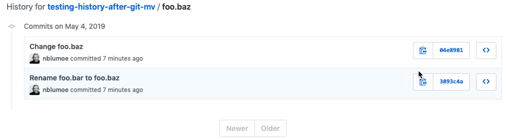

This repo tests the GitHub file history after using `git mv`.

Commits:
1. [create foo.bar file with basic content](https://github.com/nblumoe/testing-history-after-git-mv/commit/f963b452cb1b3f54b91b78bba1d9520d7222321b)
2. [rename file: `git mv foo.bar foo.baz`](https://github.com/nblumoe/testing-history-after-git-mv/commit/3893c4a740483c2b499c926af12850b86a994fb2) 
3. [edit foo.baz](https://github.com/nblumoe/testing-history-after-git-mv/commit/04e89817289c5c1186685a60cb24fc152271caa3)

All commits can be seen on the command line by using the `--follow` option:

```sh
$ git --no-pager log --follow foo.baz
commit 04e89817289c5c1186685a60cb24fc152271caa3 (HEAD -> master, origin/master)
Author: Nils Blum-Oeste <nils@blum-oeste.de>
Date:   Sat May 4 17:24:56 2019 +0200

    Change foo.baz

commit 3893c4a740483c2b499c926af12850b86a994fb2
Author: Nils Blum-Oeste <nils@blum-oeste.de>
Date:   Sat May 4 17:24:18 2019 +0200

    Rename foo.bar to foo.baz

commit f963b452cb1b3f54b91b78bba1d9520d7222321b
Author: Nils Blum-Oeste <nils@blum-oeste.de>
Date:   Sat May 4 17:23:16 2019 +0200

    Add foo.bar
```

GitHub doesn't show the full history of the file, going beyond the renaming, but only shows commits since the
renaming:


[https://github.com/nblumoe/testing-history-after-git-mv/commits/master/foo.baz](https://github.com/nblumoe/testing-history-after-git-mv/commits/master/foo.baz)
